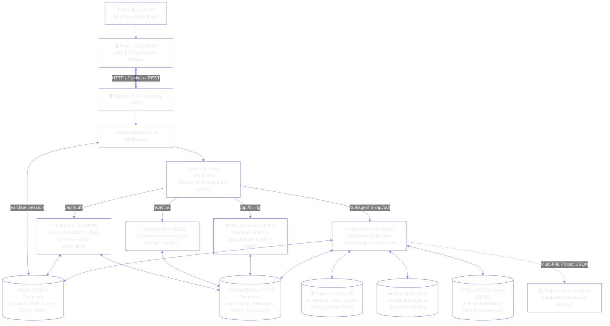
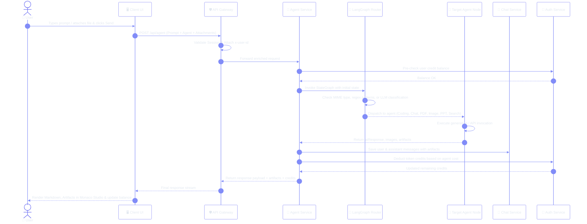
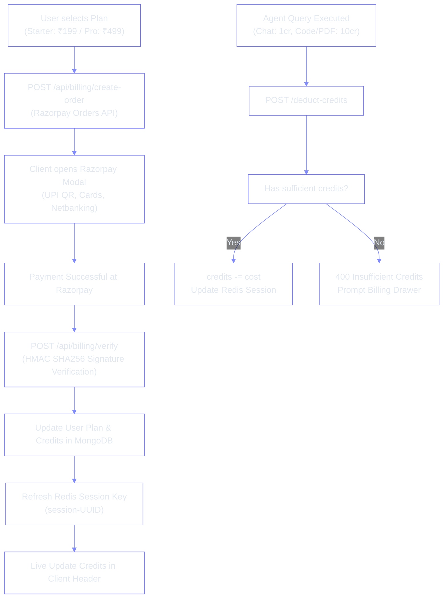

<<<<<<< HEAD
# ⚡ ShifraAI™ — Autonomous Multi-Agent Conversational AI Platform
### Enterprise Distributed Microservices • Multi-Model LLM Orchestration • Custom Vector RAG
#### Next-Generation AI Ecosystem Powered by LangGraph, Google Gemini, Groq, OpenRouter & Clipdrop

<p align="center">
  
</p>

<p align="center">
  
</p>

---

## 🏆 Badges & Standards

<p align="center">
  
  
  
  
  
  
  
  
  
</p>

### 💻 Programming Languages & Technologies Used

<p align="center">
  <a href="https://skillicons.dev">
    
  </a>
</p>

<p align="center">
  
  
  
  
  
  
  
  
  
  
  
  
  
  
  
  
</p>

---

## 🌟 Interactive Dual Workspace (Chat Hub & Monaco Live Studio)

<div align="center">
  <table>
    <tr>
      <td align="center" width="50%">
        <br/>
        <b>💬 Conversational Intelligence Hub</b><br/>
        
        <br/>
        <sub>Multi-turn memory, realtime speech-to-text, prompt classifier & multimodal file dropzone</sub>
      </td>
      <td align="center" width="50%">
        <br/>
        <b>💻 Live Monaco Code & Project Studio</b><br/>
        
        <br/>
        <sub>In-browser multi-file project execution, syntax coloring, live preview & instant downloads</sub>
      </td>
    </tr>
  </table>
=======
<div align="center">


<p align="center">
  <b>Autonomous Multi-Agent Conversational AI Platform</b>
</p>

<p align="center">
  LangGraph • Gemini • Groq • DeepSeek • RAG • SearXNG • Redis • MongoDB
</p>

<p align="center">
  <a href="#-highlights--key-innovations">Features</a> •
  <a href="#-system-architecture--data-flow">Architecture</a> •
  <a href="#-technology-stack--logos">Tech Stack</a> •
  <a href="#-getting-started">Getting Started</a>
</p>

<br>


[](https://opensource.org/licenses/ISC)
[](https://nodejs.org)
[](https://expressjs.com)
[](https://react.dev)
[](https://vitejs.dev)
[](https://tailwindcss.com)
[](https://www.docker.com)
[](https://redis.io)
[](https://www.mongodb.com)

**An enterprise-grade, distributed microservices AI assistant platform powered by LangGraph multi-agent state machines, multi-model LLM routing (Gemini 3.8 Flash, Groq, OpenRouter DeepSeek), custom in-memory & persistent Vector Database for PDF RAG, Clipdrop AI image synthesis, automated PowerPoint generation, live Monaco interactive code preview, and integrated Razorpay monetization.**

<sub>Crafted with passion by **Lead Developer Suvojit Manna** and the **ShifraAI Team**.</sub>

---

[Explore Features](#-core-capabilities--agent-fleet) •
[System Architecture](#-system-architecture--data-flow) •
[Tech Stack](#-technology-stack--logos) •
[Getting Started](#-getting-started) •
[API Reference](#-api-gateway--microservices-routes) •
[Directory Structure](#-repository-structure)

---

>>>>>>> c750d145d097611cf315eefd811514cb0cf36ec8
</div>

To provide an elite developer and end-user productivity environment:
* **Autonomous Task Classification:** Automatically categorizes queries into Code, PDF RAG, Image Synthesis, Multimodal Vision, PowerPoint Presentations, Web Search, or Chit-chat.
* **Embedded VS Code Power:** Full Monaco Editor integration supporting multiple tabs (`index.html`, `style.css`, `script.js`), live interactive code editing, error highlights, and zero-reload DOM refreshes.
* **Instant Sandboxed Rendering:** Runs generated interactive applications (calculators, games, web dashboards, responsive landing pages) in a secure, sandboxed browser iframe.
* **Permanent Cloud CDN Ingestion:** High-speed cloud asset storage via Cloudinary for synthetic imagery, generated PDFs, and PPT presentations.
* **Universal Light / Dark / System Mode:** Native dark mode engineered with Tailwind CSS v4, custom Monaco themes (`shifra-dark` & `shifra-light`), and fluid Framer Motion transitions.

| Feature Dimension | 💬 Conversational Hub | 💻 Monaco Artifact Studio |
| :--- | :--- | :--- |
| **Primary Interaction** | Natural language, voice dictation & attachments | Live multi-tab code editing & preview |
| **Execution Target** | LangGraph State Machine & AI Router | In-browser sandboxed runtime iframe |
| **Supported File Types** | PDF, PNG, JPG, WEBP, GIF, Speech Audio | HTML, CSS, JavaScript, Python, JSON |
| **Feedback Loop** | Dynamic credit deduction & message history | Live preview reload, reset & ZIP download |
| **Underlying Models** | Groq LPU, Gemini 3.8 Flash, SearXNG, Clipdrop | OpenRouter DeepSeek-Chat & Fallback Gemini |

---

## 🌍 Architecture & Deployment Topology

| Resource | Service URL / Port | Role |
| :--- | :--- | :--- |
| **🖥️ Frontend Client** | `http://localhost:5173` | React 19 + Vite 8 UI Dashboard, Chat & Artifacts |
| **🛡️ API Gateway** | `http://localhost:8000` | Central Express 5 reverse proxy, session guard & CORS |
| **🔑 Auth Service** | `http://localhost:8001` | Google OAuth 2.0 verification, users & credits |
| **💬 Chat Service** | `http://localhost:8002` | MongoDB conversation history, messages & artifact storage |
| **🧠 Agent Service** | `http://localhost:8003` | LangGraph multi-agent graph, Custom Vector DB & generators |
| **💳 Billing Service** | `http://localhost:8004` | Razorpay checkout, UPI / Card payments & plan upgrades |
| **⚡ Redis Cache** | `localhost:6379` | User sessions, RAG response cache & processing status |
| **🔍 SearXNG Container** | `http://localhost:8080` | Self-hosted privacy metasearch engine (Docker) |

---

## 🧠 Project Overview

### The Challenge
Modern AI applications often rely on monolithic prompts and single LLM models that fail when handling diverse user tasks: general chatting requires low-latency inference, coding demands deep reasoning, document analysis requires vector embeddings and grounded citations, while image and slide generation demand specialized external APIs. Furthermore, typical AI chatbots provide raw markdown code blocks without allowing users to view, test, modify, or download full multi-file web applications.

### The Solution: ShifraAI™
**ShifraAI™** solves this through a distributed **LangGraph Multi-Agent Architecture** running on an Express 5 microservices backend. Incoming prompts and files are classified by an intelligent router that dispatches the task to dedicated agent nodes powered by the optimal model for the job: **Groq** for instant chat, **OpenRouter DeepSeek** for full-stack code synthesis, **Google Gemini 3.8 Flash** for multimodal OCR and PDF RAG, **Clipdrop SDXL** for creative image rendering, **PPTXGenJS** for executive presentations, and **SearXNG/Tavily** for web search.

---

## ✨ Key Capabilities & Agent Fleet

### 1. 🧭 Intelligent Intent & MIME Router Node
* Dynamically inspects uploaded MIME types (PDFs route to `pdfRag`, images route to `imageAnalyzer`).
* Evaluates conversational keywords and creator queries via high-speed regex pattern matching.
* Employs an LLM decision classifier as a fallback for complex prompts to determine the best agent node (`chat`, `coding`, `pdf`, `ppt`, `image`, or `search`).

### 2. 💻 Coding Agent & Live Monaco Artifact Studio
* Generates complete, multi-file responsive web applications (typically `index.html`, `style.css`, and `script.js`).
* Automatically integrates real, high-resolution **Unsplash image URLs** instead of broken placeholder images.
* Outputs structured JSON parsed directly into the **Monaco Editor**, enabling tab switching, in-browser code editing, live sandboxed iframe preview, code copying, and multi-file downloads.

### 3. 📚 Custom Vector Database & PDF RAG Engine
* **Zero External Vector DB Dependencies**: Built with a custom, document-isolated vector database (`CustomVectorDB`) combining in-memory caching with disk JSON persistence.
* Ingests PDFs up to 30 MB, extracts text per page, chunks content, and generates vector embeddings via Google Gemini (`text-embedding-004`).
* Performs **Cosine Similarity Search** with score thresholds to answer user questions grounded strictly in the source material, citing exact page numbers.

### 4. 🎨 AI Image Synthesis & Cloudinary CDN
* Powered by **Clipdrop AI (SDXL Text-to-Image)**.
* Includes an automated AI Prompt Enhancement node that enriches basic user prompts with cinematic lighting, camera angles, textures, and artistic styles.
* Automatically uploads output buffers to **Cloudinary** for permanent cloud storage and returns high-speed CDN URLs.

### 5. 👁️ Multimodal Vision & OCR Analyzer
* Employs **Google Gemini 3.8 Flash Vision** to analyze single or multiple uploaded images (up to 15 MB each).
* Performs OCR text extraction, chart interpretation, diagram breakdown, and cross-image comparative reasoning.

### 6. 📊 Autonomous PowerPoint Deck Architect
* Generates complete executive `.pptx` presentation decks utilizing **pptxgenjs**.
* Implements a 16:9 widescreen layout, custom corporate color palettes, numbered milestone cards, bullet points, and an executive summary slide.
* Provides direct download endpoints and optional Cloudinary cloud backups.

### 7. 🌐 Dual Hybrid Web Intelligence (SearXNG + Tavily)
* High-relevance web search engine utilizing a self-hosted **SearXNG Docker container** as primary, with automatic fallback to **Tavily AI Search**.
* Features built-in source deduplication, junk-link filtering, and semantic relevance reranking to cite real-time news and verified web pages.

### 8. 💳 Usage-Based Token Economics & Razorpay Billing
* Configurable token billing model: Chat (`1 cr`), Search (`5 cr`), Coding (`10 cr`), PDF RAG (`10 cr`), PPT (`10 cr`), Image (`10 cr`).
* Integrated with **Razorpay UPI & Cards**, supporting instant QR payments and plan subscriptions (Free, Starter, Pro).
* Synchronizes user credit balances in real time across the API Gateway, Redis session cache, and client dashboard.

---

## 🛠️ Languages, Tools & Technology Stack

```
                                  SHIFRAAI TECH STACK
┌────────────────────────────────────────────────────────────────────────────────────────┐
│  FRONTEND            React 19  •  Vite 8  •  Tailwind CSS v4  •  Redux Toolkit         │
│  CODE STUDIO         Monaco Editor (@monaco-editor/react)  •  Sandboxed Live IFrame    │
│  UI & MOTION         Framer Motion  •  Lucide Icons  •  React Markdown  •  Speech API  │
│  API GATEWAY         Express.js 5  •  express-http-proxy  •  Cookie Parser  •  CORS    │
│  BACKEND RUNTIME     Node.js (v18+ / v20+)  •  ES Modules (ESM)  •  Nodemon            │
│  DATABASE & CACHE    MongoDB Atlas  •  Mongoose ODM (v9)  •  Redis 7 (ioredis)         │
│  AGENT ORCHESTRATION LangGraph StateGraph  •  LangChain Core  •  Cyclical Workflows    │
│  AI INFERENCE        Gemini 3.8 Flash  •  Groq LPU (GPT-OSS)  •  OpenRouter (DeepSeek) │
│  RAG & PARSING       Custom In-Memory Vector DB  •  Cosine Sim  •  pdf-parse  •  PDFKit│
│  DOCUMENT GENERATION pptxgenjs (16:9 Decks)  •  Clipdrop AI SDXL  •  Cloudinary CDN    │
│  SEARCH ENGINES      SearXNG (Self-Hosted Docker)  •  Tavily AI Search API             │
│  MONETIZATION        Razorpay Payments SDK  •  UPI QR / Netbanking / Cards             │
└────────────────────────────────────────────────────────────────────────────────────────┘
```

---

## 🏗️ System Architecture & Data Flow



---

## 🔄 Sequence Diagrams

### 1. LangGraph Multi-Agent Routing & Execution Pipeline



---

### 2. Custom Vector DB Ingestion & PDF RAG Retrieval Pipeline

```mermaid
%%{init: {'theme': 'base', 'themeVariables': { 'background': 'transparent', 'mainBkg': 'transparent', 'primaryColor': 'transparent', 'primaryBorderColor': '#6366f1', 'primaryTextColor': '#e2e8f0', 'lineColor': '#818cf8' }}}%%
flowchart LR
    A["Uploaded PDF File\n(up to 30 MB)"] --> B["PDF Parser & Text Extractor\n(pdf-parse / PDFKit)"]
    B --> C["Recursive Text Chunking\n(500-1000 char windows + page meta)"]
    C --> D["Gemini Embedding Model\n(text-embedding-004)"]
    D --> E["Custom Vector Store\n(In-Memory + Disk JSON Isolation)"]
    
    Q["User Question\n('What is the conclusion?')"] --> EEmbed["Embed Question\n(text-embedding-004)"]
    EEmbed --> Search["Cosine Similarity Search\n(topK=5, minScore=0.15)"]
    E --> Search
    Search --> Prompt["Context Injection Prompt\n(Strict Grounding & Page Numbers)"]
    Prompt --> LLM["Google Gemini 3.8 Flash"]
    LLM --> Out["Grounded Answer +\nTraceable Page Citations"]
```



---

### 3. Credit Deduction & Razorpay Subscription Lifecycle



---

## 📁 Project Directory Structure

```bash
multiagent_chat_Bot/
├── 📄 README.md                        # Master Project Documentation
├── 🐳 docker-compose.yaml              # Docker orchestration (Redis & SearXNG)
│
├── 📂 client/                          # Frontend Single Page Application (React 19)
│   ├── 📄 index.html                   # HTML5 Entry Point
│   ├── 📄 vite.config.js               # Vite 8 build configuration
│   ├── 📄 package.json                 # Frontend dependencies & scripts
│   ├── 📂 src/
│   │   ├── 📄 App.jsx                  # Root component, theme listener & user sync
│   │   ├── 📄 main.jsx                 # Application bootstrap with Redux Provider
│   │   ├── 📄 index.css                # Tailwind CSS v4 styling entrypoint
│   │   ├── 📂 pages/
│   │   │   └── 📄 Home.jsx             # Main dashboard, chat area & Google auth modal
│   │   ├── 📂 components/
│   │   │   ├── 📄 Artifact.jsx         # Monaco Editor & Sandboxed IFrame Preview Studio
│   │   │   ├── 📄 BillingDrawer.jsx    # Razorpay payment & plan upgrade drawer
│   │   │   ├── 📄 ChatArea.jsx         # Chat stream, quick prompts & top navigation
│   │   │   ├── 📄 ChatInput.jsx        # Multimodal input, agent selector & voice dictation
│   │   │   ├── 📄 MessageBuble.jsx     # Markdown renderer, code syntax & RAG citations
│   │   │   ├── 📄 MessageList.jsx      # Scrollable chat feed & typing indicators
│   │   │   ├── 📄 Nav.jsx              # Top bar, credit display & user avatar menu
│   │   │   ├── 📄 Sidebar.jsx          # Conversation history & agent shortcuts
│   │   │   └── 📄 ThemeToggle.jsx      # Dark / Light / System switcher
│   │   ├── 📂 redux/                   # Redux Toolkit state slices
│   │   │   ├── 📄 store.js             # Global Redux store
│   │   │   ├── 📄 userSlice.js         # User profile, credits & plan state
│   │   │   ├── 📄 conversationSlice.js # Active conversation threads
│   │   │   ├── 📄 messageSlice.js      # Message streams & active artifacts
│   │   │   ├── 📄 themeSlice.js        # Light / Dark theme state
│   │   │   └── 📄 uiSlice.js           # UI drawers & modal toggles
│   │   ├── 📂 features/                # Axios API service integrations
│   │   │   ├── 📄 getCurrentUser.js    # /api/me caller
│   │   │   ├── 📄 createConverSation.js# New conversation creator
│   │   │   ├── 📄 getConverSations.js  # Conversation list fetcher
│   │   │   ├── 📄 getMessages.js       # Message history loader
│   │   │   ├── 📄 sendMessage.js       # Agent dispatch caller
│   │   │   ├── 📄 createOrder.js       # Razorpay order creator
│   │   │   ├── 📄 verifyPayment.js     # Payment signature verifier
│   │   │   ├── 📄 pdfRagApi.js         # Dedicated PDF RAG API client
│   │   │   └── 📄 logout.js            # Session logout caller
│   │   └── 📂 utils/
│   │       └── 📄 axios.js             # Configured Axios instance with credentials
│
└── 📂 server/                          # Backend Microservices Ecosystem
    ├── 📄 package.json                 # Server workspace package
    ├── 📄 redis.js                     # Shared Redis client connection (ioredis)
    ├── 📂 searxng/                     # SearXNG configuration files
    │   └── 📄 settings.yml             # Engines, rate limits & output formats
    │
    ├── 📂 gateway/                     # API Gateway Service (Port 8000)
    │   ├── 📄 index.js                 # Gateway entry & reverse proxy routing
    │   ├── 📂 middleware/
    │   │   └── 📄 auth.middleware.js   # Redis cookie/session verification
    │   ├── 📂 controllers/
    │   │   └── 📄 user.controller.js   # Current authenticated user endpoint (/api/me)
    │   └── 📂 utils/
    │       └── 📄 proxyWithHeader.js   # Header injection (x-user-id forwarding)
    │
    └── 📂 services/                    # Autonomous Domain Microservices
        ├── 📂 auth/                    # Auth Service (Port 8001)
        │   ├── 📄 index.js             # Express app entry & MongoDB connection
        │   ├── 📂 controllers/
        │   │   └── 📄 auth.controller.js # Google token verification, login, deduct credits
        │   ├── 📂 models/
        │   │   └── 📄 user.model.js    # User schema (credits, plan, expiration)
        │   └── 📂 routes/
        │       └── 📄 auth.routes.js   # /login, /logout, /deduct-credits
        │
        ├── 📂 chatservice/             # Chat Service (Port 8002)
        │   ├── 📄 index.js             # Service entry
        │   ├── 📂 controllers/
        │   │   └── 📄 chat.controller.js # Conversation CRUD & message persistence
        │   ├── 📂 models/
        │   │   ├── 📄 conversation.models.js # Conversation schema
        │   │   └── 📄 message.models.js      # Message, artifacts & file schema
        │   └── 📂 routes/
        │       └── 📄 chat.routes.js   # Chat history & conversation routes
        │
        ├── 📂 agent/                   # Agent Service (Port 8003)
        │   ├── 📄 index.js             # Express app & static file download endpoints
        │   ├── 📂 graph/               # LangGraph State Machine Definition
        │   │   ├── 📄 graph.js         # Compiled StateGraph workflow & edges
        │   │   ├── 📄 router.js        # Multi-factor intelligent routing node
        │   │   └── 📄 state.js         # LangGraph state interface schema
        │   ├── 📂 agents/              # Specialized Agent Implementations
        │   │   ├── 📄 chat.agent.js    # Groq conversational agent
        │   │   ├── 📄 coding.agent.js  # DeepSeek code & project generator
        │   │   ├── 📄 pdfRag.agent.js  # Custom vector search Q&A RAG agent
        │   │   ├── 📄 image.agent.js   # Clipdrop AI image synthesis
        │   │   ├── 📄 imageAnalyzer.agent.js # Gemini Vision OCR analysis
        │   │   ├── 📄 ppt.agent.js     # PPTXGenJS presentation deck agent
        │   │   ├── 📄 pdf.agent.js     # PDFKit summary document builder
        │   │   └── 📄 search.agent.js  # SearXNG & Tavily web research
        │   ├── 📂 utils/               # RAG & Utility Modules
        │   │   ├── 📄 vectorStore.js   # Custom In-Memory + Disk JSON Vector DB
        │   │   ├── 📄 pdfProcessor.js  # Text extraction & page segmenter
        │   │   ├── 📄 embeddings.js    # Gemini batch embeddings generator
        │   │   └── 📄 searchReranker.js# Web results deduplication & reranker
        │   └── 📂 config/              # Cloudinary, Model, Memory & Multer setups
        │
        └── 📂 billing/                 # Billing Service (Port 8004)
            ├── 📄 index.js             # Service entry & MongoDB connection
            ├── 📂 config/
            │   ├── 📄 plan.js          # Free (100cr), Starter (500cr), Pro (1000cr)
            │   └── 📄 razorPay.js      # Razorpay client instance
            ├── 📂 controller.js/
            │   └── 📄 billing.controller.js # Order creation & signature verification
            └── 📂 routes/
                └── 📄 billing.route.js # /create-order & /verify endpoints
```

---

## 🔐 Environment Variables (`.env`)

### 1. API Gateway Configuration (`server/gateway/.env`)

```env
PORT=8000
CLIENT_URL=http://localhost:5173
REDIS_URL=redis://localhost:6379

AUTH_SERVICE=http://localhost:8001
CHAT_SERVICE=http://localhost:8002
AGENT_SERVICE=http://localhost:8003
BILLING_SERVICE=http://localhost:8004
```

### 2. Auth Service Configuration (`server/services/auth/.env`)

```env
PORT=8001
MONGO_URI=mongodb+srv://<username>:<password>@cluster.mongodb.net/shifra_auth?retryWrites=true&w=majority
REDIS_URL=redis://localhost:6379
```

### 3. Chat Service Configuration (`server/services/chatservice/.env`)

```env
PORT=8002
MONGO_URI=mongodb+srv://<username>:<password>@cluster.mongodb.net/shifra_chat?retryWrites=true&w=majority
```

### 4. Agent Service Configuration (`server/services/agent/.env`)

```env
PORT=8003
MONGO_URI=mongodb+srv://<username>:<password>@cluster.mongodb.net/shifra_agent?retryWrites=true&w=majority
REDIS_URL=redis://localhost:6379
SERVER_URL=http://localhost:8003

# Internal Service Handshakes
AUTH_SERVICE=http://localhost:8001
CHAT_SERVICE=http://localhost:8002

# AI LLM Inference Providers
GROQ_API_KEY=your_groq_api_key_here
GROQ_MODEL=openai/gpt-oss-120b

GEMINI_API_KEY=your_google_gemini_api_key_here
GEMINI_MODEL=gemini-3.8-flash

OPENROUTER_API_KEY=your_openrouter_api_key_here
OPENROUTER_MODEL=deepseek/deepseek-chat

# Image Generation & Media Cloud Storage
CLIPDROP_API_KEY=your_clipdrop_api_key_here
CLOUDINARY_CLOUD_NAME=your_cloudinary_cloud_name
CLOUDINARY_API_KEY=your_cloudinary_api_key
CLOUDINARY_API_SECRET=your_cloudinary_api_secret

# Search Engine Orchestration
SEARCH_PROVIDER=searxng
SEARXNG_URL=http://localhost:8080
TAVILY_API_KEY=your_tavily_api_key_here
```

### 5. Billing Service Configuration (`server/services/billing/.env`)

```env
PORT=8004
MONGO_URI=mongodb+srv://<username>:<password>@cluster.mongodb.net/shifra_billing?retryWrites=true&w=majority
AUTH_SERVICE=http://localhost:8001

RAZORPAY_KEY_ID=your_razorpay_key_id
RAZORPAY_KEY_SECRET=your_razorpay_key_secret
```

### 6. Client Frontend Configuration (`client/.env`)

```env
VITE_API_URL=http://localhost:8000
VITE_GOOGLE_CLIENT_ID=your_google_oauth_client_id.apps.googleusercontent.com
VITE_GOOGLE_AUTH_URL=https://accounts.google.com/o/oauth2/v2/auth
VITE_RAZORPAY_KEY_ID=your_razorpay_key_id
```

---

## ⚡ Installation & Local Setup Guide

### Prerequisites
* **Node.js**: `v18.0.0` or higher (Recommended: `v20.x`)
* **npm**: `v9.x` or higher
* **Docker & Docker Compose**: For launching Redis and SearXNG
* **MongoDB**: A running local instance or a [MongoDB Atlas](https://www.mongodb.com/atlas) connection URI

### Step 1: Clone Repository
```bash
git clone https://github.com/suvojitmanna/multiagent_chat_Bot.git
cd multiagent_chat_Bot
```

### Step 2: Start Infrastructure Containers (Docker Compose)
Launch Redis and the SearXNG metasearch engine from the `server/` directory:
```bash
cd server
docker-compose up -d
```
* **Redis**: Accessible at `localhost:6379`
* **SearXNG**: Accessible at `http://localhost:8080`

### Step 3: Install Dependencies
Install dependencies across the API Gateway, Domain Services, and Client:
```bash
# 1. API Gateway
cd gateway && npm install

# 2. Auth Service
cd ../services/auth && npm install

# 3. Chat Service
cd ../chatservice && npm install

# 4. Agent Service
cd ../agent && npm install

# 5. Billing Service
cd ../billing && npm install

# 6. Frontend Client
cd ../../../client && npm install
```

### Step 4: Run the Services
Start the microservices and client in development mode across separate terminal tabs:

```bash
# Terminal 1: API Gateway (Port 8000)
cd server/gateway && npm run dev

# Terminal 2: Auth Service (Port 8001)
cd server/services/auth && npm run dev

# Terminal 3: Chat Service (Port 8002)
cd server/services/chatservice && npm run dev

# Terminal 4: Agent Service (Port 8003)
cd server/services/agent && npm run dev

# Terminal 5: Billing Service (Port 8004)
cd server/services/billing && npm run dev

# Terminal 6: Frontend Client (Port 5173)
cd client && npm run dev
```

Open your browser and navigate to **`http://localhost:5173`** to access **ShifraAI**!

---

## 🔗 Key API Endpoints Reference

| Module | Method | Endpoint | Auth | Target Service | Description |
| :--- | :---: | :--- | :---: | :--- | :--- |
| **Authentication** | `POST` | `/api/auth/login` | No | Auth Service (:8001) | Authenticates Google token & sets Redis session cookie |
| **Authentication** | `POST` | `/api/auth/logout` | Yes | Auth Service (:8001) | Deletes Redis session key & clears auth cookie |
| **User Profile** | `GET` | `/api/me` | Yes | API Gateway (:8000) | Fetches authenticated user, current credits & active plan |
| **Chat Hub** | `GET` | `/api/chat/get-conversations` | Yes | Chat Service (:8002) | Retrieves list of all user conversation threads |
| **Chat Hub** | `POST`| `/api/chat/create-conversation`| Yes | Chat Service (:8002) | Creates a new conversation thread |
| **Chat Hub** | `GET` | `/api/chat/get-messages/:id` | Yes | Chat Service (:8002) | Retrieves full message stream & generated artifacts |
| **Agent Orchestrator**| `POST`| `/api/agent` | Yes | Agent Service (:8003) | Dispatches prompt & files to LangGraph StateGraph |
| **PDF RAG Studio** | `POST`| `/api/pdf/upload` | Yes | Agent Service (:8003) | Ingests PDF, chunks text & indexes vectors into Custom DB |
| **PDF RAG Studio** | `POST`| `/api/pdf/query` | Yes | Agent Service (:8003) | Queries indexed document via vector similarity search |
| **Billing & Payments**| `POST`| `/api/billing/create-order` | Yes | Billing Service (:8004)| Creates Razorpay checkout order for credit plans |
| **Billing & Payments**| `POST`| `/api/billing/verify` | Yes | Billing Service (:8004)| Validates Razorpay HMAC signature & credits user account |

---

## 💳 Subscription Plans & Credit Usage

| Plan Name | Price (INR) | Credits Included | Validity | Best Suited For |
| :--- | :---: | :---: | :---: | :--- |
| **Free Tier** | **₹0** | **100 Credits** | 30 Days | General chat, exploration & lightweight coding |
| **Starter Plan** | **₹199** | **500 Credits** | 30 Days | Document RAG queries, web research & slide decks |
| **Pro Plan** | **₹499** | **1,000 Credits** | 30 Days | Power users, full-stack builders, image creators & teams |

### ⚡ Agent Credit Consumption Table
- 🤖 **Chat Agent**: `1 credit` per prompt
- 🧭 **Auto Routing**: `1 credit` base
- 🌐 **Web Search Agent**: `5 credits` per research query
- 💻 **Coding & Full-Stack Builder**: `10 credits` per project
- 📚 **PDF RAG Document Analysis**: `10 credits` per query
- 📊 **PowerPoint Presentation Deck**: `10 credits` per deck
- 🎨 **Clipdrop AI Image Generation**: `10 credits` per image
- 👁️ **Gemini Multimodal Vision Analysis**: `10 credits` per image batch

---

## 👨‍💻 Project Author & Team

<p align="center">
  <b>Developed with dedication by the ShifraAI Engineering Team</b><br/>
  <b>Lead Developer & AI Architect:</b> Suvojit Manna<br/>
  <i>Full Stack MERN Developer • Autonomous Multi-Agent Systems</i>
</p>

<p align="center">
  <a href="https://github.com/suvojitmanna"></a>
  <a href="https://linkedin.com/in/suvojit-manna"></a>
</p>

---

## 📜 License

This project is licensed under the **ISC License** — feel free to adapt, extend, and build upon it for personal, academic, or commercial projects.

---

## 👁️ Visitor Statistics

<p align="center">
  
</p>

---

<p align="center">
  
</p>
