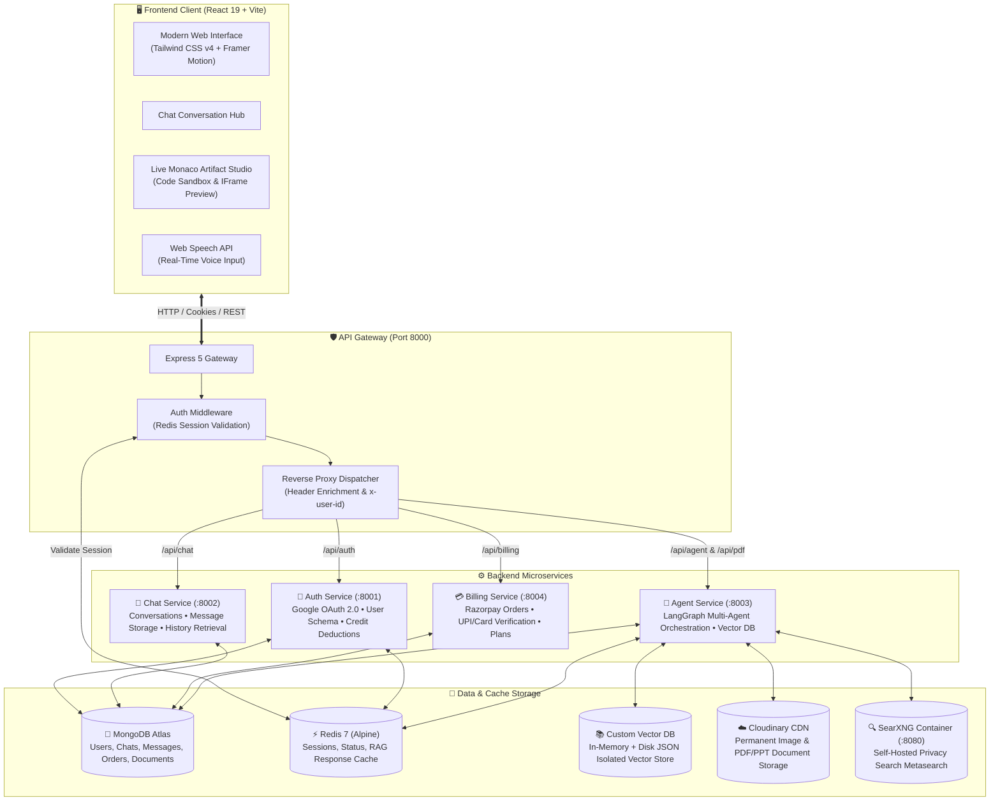
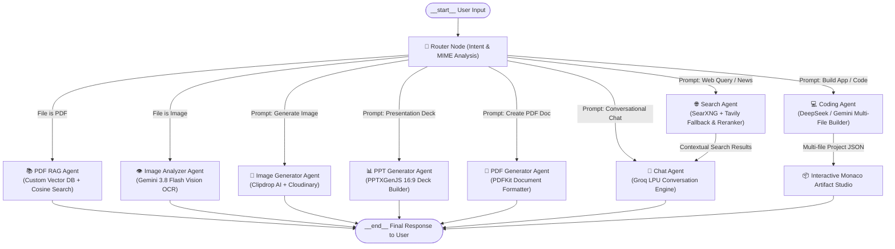
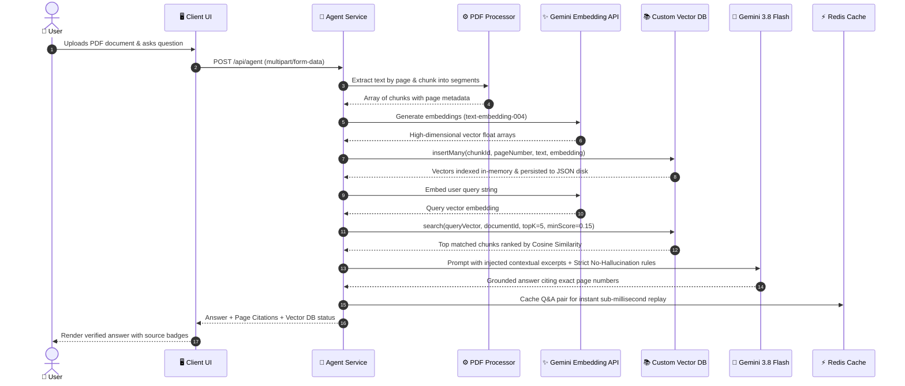

<div align="center">


<p align="center">
  <b>Autonomous Multi-Agent Conversational AI Platform</b>
</p>

<p align="center">
  LangGraph • Gemini • Groq • DeepSeek • RAG • SearXNG • Redis • MongoDB
</p>

<p align="center">
  <a href="#-highlights--key-innovations">Features</a> •
  <a href="#-system-architecture--data-flow">Architecture</a> •
  <a href="#-technology-stack--logos">Tech Stack</a> •
  <a href="#-getting-started">Getting Started</a>
</p>

<br>


[](https://opensource.org/licenses/ISC)
[](https://nodejs.org)
[](https://expressjs.com)
[](https://react.dev)
[](https://vitejs.dev)
[](https://tailwindcss.com)
[](https://www.docker.com)
[](https://redis.io)
[](https://www.mongodb.com)

**An enterprise-grade, distributed microservices AI assistant platform powered by LangGraph multi-agent state machines, multi-model LLM routing (Gemini 3.8 Flash, Groq, OpenRouter DeepSeek), custom in-memory & persistent Vector Database for PDF RAG, Clipdrop AI image synthesis, automated PowerPoint generation, live Monaco interactive code preview, and integrated Razorpay monetization.**

<sub>Crafted with passion by **Lead Developer Suvojit Manna** and the **ShifraAI Team**.</sub>

---

[Explore Features](#-core-capabilities--agent-fleet) •
[System Architecture](#-system-architecture--data-flow) •
[Tech Stack](#-technology-stack--logos) •
[Getting Started](#-getting-started) •
[API Reference](#-api-gateway--microservices-routes) •
[Directory Structure](#-repository-structure)

---

</div>

<br />

## 🌟 Highlights & Key Innovations

- 🧠 **LangGraph Orchestrated Multi-Agent Architecture**: Intelligent request routing engine using heuristic classification, content analysis, and LLM fallback decisions to dispatch tasks to specialized agent nodes.
- 💻 **Interactive Code & Project Studio**: Generates full-stack web applications, calculators, games, and UI components; renders code instantly inside an embedded **Monaco Editor** with a live sandboxed `<iframe>` preview, syntax highlighting, and single-click file downloads.
- 📄 **Custom In-Memory & Disk-Persistent Vector Database**: Purpose-built vector database with isolated document collections, cosine similarity search, chunking, and Gemini embeddings (`text-embedding-004`) for high-fidelity PDF Question & Answering with exact page citations.
- 🎨 **Clipdrop AI Image Synthesis**: Generates photorealistic digital artwork and visual concepts using SDXL via Clipdrop API, enhanced by an automated prompt optimization agent and backed by **Cloudinary CDN** permanent asset hosting.
- 👁️ **Multimodal Vision Analysis**: Deep image analysis powered by **Google Gemini 3.8 Flash Vision**, providing OCR text extraction, chart and table comprehension, and cross-image comparative reasoning.
- 📊 **Autonomous PowerPoint Deck Generation**: Generates comprehensive 16:9 widescreen `.pptx` presentation decks utilizing **pptxgenjs** with adaptive color palettes, executive KPI cards, and instant download endpoints.
- 🌐 **Intelligent Hybrid Web Search**: High-relevance web intelligence featuring a private self-hosted **SearXNG metasearch container** with automatic fallback to **Tavily AI Search**, complete with image and source deduplication and relevance reranking.
- 🎙️ **Real-Time Voice Dictation**: Integrated Web Speech API microphone recognition with interim transcription streaming, auto-prefixing, and ambient speech detection.
- 💳 **Usage-Based Token Economics & Razorpay Billing**: Granular per-agent token pricing (Chat: 1 credit, Search: 5 credits, Code/PDF/PPT/Image: 10 credits), integrated with **Razorpay UPI & Cards**, real-time credit tracking, and plan management (Free, Starter, Pro).
- 🔐 **High-Performance Distributed Microservices**: Clean separation of concerns with an Express 5 API Gateway, Redis session management, distributed authentication, chat persistence, billing, and agent execution layers.
- 🌓 **Adaptive Light / Dark / System Theme**: High-contrast, accessibility-focused interface engineered with Tailwind CSS v4, Monaco dynamic theme swapping (`shifra-dark` & `shifra-light`), and fluid Framer Motion animations.

<br />

---

## 🛠️ Technology Stack & Logos

### 🎨 Frontend Ecosystem

| Technology | Badge / Logo | Version | Purpose |
| :--- | :--- | :--- | :--- |
| **React** |  | `^19.2.8` | Component-based reactive UI framework |
| **Vite** |  | `^8.3.0` | Ultra-fast next-generation frontend build tooling |
| **Tailwind CSS** |  | `^4.3.3` | Modern utility-first CSS styling engine |
| **Redux Toolkit** |  | `^2.12.0` | Global state management for user, chats, and artifacts |
| **Monaco Editor** |  | `^4.7.0` | In-browser VS Code editing experience with syntax highlighting |
| **Framer Motion** |  | `^13.4.3` | Fluid gesture controls, drawer animations & transitions |
| **Lucide Icons** |  | `^1.47.0` | Lightweight modern UI iconography |
| **Axios** |  | `^1.20.0` | Promise-based HTTP client for API Gateway calls |

<br />

### ⚙️ Backend & Microservices

| Technology | Badge / Logo | Version | Purpose |
| :--- | :--- | :--- | :--- |
| **Node.js** |  | `v18+ / v20+` | Server-side JavaScript runtime environment |
| **Express.js** |  | `^5.2.1` | Robust web application & routing framework |
| **LangChain** |  | `^1.5.11` | Foundation framework for LLM chains and tools |
| **LangGraph** |  | `^0.2.x` | Cyclical multi-agent state machine and workflow graph |
| **MongoDB / Mongoose** |  | `^9.10.1` | NoSQL document database for messages & users |
| **Redis / ioredis** |  | `^6.0.0` | High-speed cache for sessions, status, and RAG memory |
| **Docker Compose** |  | `v2+` | Container orchestration for Redis & SearXNG services |
| **HTTP Proxy** |  | `^2.1.2` | High-throughput reverse proxy routing at API Gateway |

<br />

### 🤖 AI Providers & Intelligence Engines

| Engine / Provider | Badge / Logo | Model / Service | Capability |
| :--- | :--- | :--- | :--- |
| **Google Gemini** |  | `gemini-3.8-flash` | Multimodal vision OCR, fallback coding & RAG answering |
| **Groq LPU** |  | `openai/gpt-oss-120b` / LLaMA | Ultra-fast conversational chatting & router classification |
| **OpenRouter** |  | `deepseek/deepseek-chat` | Multi-file full-stack code synthesis & architecture generation |
| **Clipdrop AI** |  | `SDXL Text-to-Image` | High-definition text-to-image artistic rendering |
| **Cloudinary** |  | `Cloud CDN Asset API` | Secure media storage & distribution for images & documents |
| **SearXNG** |  | `Self-hosted Engine` | Privacy-preserving aggregated web search engine |
| **Tavily AI** |  | `Tavily Search API` | AI-curated web search fallback with factual relevance |
| **Razorpay** |  | `Orders & Webhooks` | Monetization, UPI QR, and Subscription management |

<br />

---

## 🏛️ System Architecture & Data Flow

ShifraAI is built on a clean **Microservices Architecture** where independent, decoupled services communicate through an **API Gateway** with centralized authentication, Redis-backed session caching, and distributed credit verification.



<br />

---

## 🔄 LangGraph Multi-Agent Orchestration Workflow

Every user query, attached image, or uploaded PDF flows through the **LangGraph State Machine**. The system dynamically assesses intent and routes the payload to the ideal agent node:



<br />

---

## ⚡ Custom Vector DB & PDF RAG Engine

ShifraAI features a standalone, lightweight, zero-external-dependency **Custom Vector Database** designed specifically for high-speed document question-answering with complete tenant isolation:



<br />

---

## 🤖 Core Capabilities & Agent Fleet

### 1. 🤖 General Chat Agent (`chat`)
- **Engine**: Groq LPU (`openai/gpt-oss-120b` or LLaMA models)
- **Features**: Ultra-low latency responses, conversational multi-turn history retrieved from Redis/Mongo memory, clean Markdown formatting, professional and structured tone.
- **Cost**: 1 Credit

### 2. 💻 Coding & Full-Stack Studio Agent (`coding`)
- **Engine**: OpenRouter (`deepseek/deepseek-chat`) with Gemini fallback
- **Features**: Generates production-ready, multi-file codebases (e.g. `index.html`, `style.css`, `script.js`). Automatically integrates real Unsplash visual assets, full responsive layouts, and modern CSS glassmorphism.
- **Artifact Integration**: Feeds generated files directly into the **Monaco Artifact Studio** for live sandboxed testing, code modifications, and ZIP/file exports.
- **Cost**: 10 Credits

### 3. 📚 PDF RAG Document Analyst (`pdfRag`)
- **Engine**: Google Gemini Embeddings + Custom Isolated Vector Store + Gemini Flash
- **Features**: Upload any PDF up to 30 MB. Parses text into segmented chunks, produces embeddings, performs vector similarity search, and answers queries with strict grounding and verifiable page-level citations.
- **Cost**: 10 Credits

### 4. 🎨 AI Image Synthesis Agent (`image`)
- **Engine**: Clipdrop AI (SDXL) + Groq Prompt Enhancer + Cloudinary Storage
- **Features**: Takes a simple user concept, automatically refines it through an AI prompt optimization agent (adding lighting, volumetric rays, camera angle, textures), calls the Clipdrop Text-to-Image API, and uploads the output to Cloudinary for permanent high-speed CDN delivery.
- **Cost**: 10 Credits

### 5. 👁️ Multimodal Vision Analyzer (`imageAnalyzer`)
- **Engine**: Google Gemini 3.8 Flash Vision
- **Features**: Supports multi-image uploads up to 15 MB each. Performs OCR text extraction, visual reasoning, chart/graph interpretation, and side-by-side visual comparisons.
- **Cost**: 10 Credits

### 6. 📊 PowerPoint Deck Architect (`ppt`)
- **Engine**: Groq LPU + `pptxgenjs`
- **Features**: Automatically generates 5 to 7 executive slides in 16:9 widescreen format, styled with strategic color accents, numbered metric cards, bulleted takeaways, and executive summary slides. Outputs downloadable `.pptx` presentations instantly.
- **Cost**: 10 Credits

### 7. 🌐 Web Intelligence & Search Agent (`search`)
- **Engine**: Self-Hosted SearXNG Docker + Tavily AI Search Fallback
- **Features**: Real-time web querying with duplicate removal, spam filtering, and semantic relevance re-ranking. Cites real URLs and live facts, feeding the synthesized context back into the conversation.
- **Cost**: 5 Credits

<br />

---

## 📁 Repository Structure

```plaintext
multiagent_chat_Bot/
├── 📄 README.md                        # Primary Project Documentation
├── 🐳 docker-compose.yaml              # Docker orchestration (Redis & SearXNG)
│
├── 📂 client/                          # Frontend Application (React 19 + Vite)
│   ├── 📄 index.html                   # HTML5 Entry Point
│   ├── 📄 vite.config.js               # Vite build configuration
│   ├── 📄 package.json                 # Frontend dependencies & scripts
│   ├── 📂 src/
│   │   ├── 📄 App.jsx                  # Root App & Theme Provider
│   │   ├── 📄 main.jsx                 # React DOM mount point
│   │   ├── 📂 pages/
│   │   │   └── 📄 Home.jsx             # Main dashboard, chat area & auth modal
│   │   ├── 📂 components/
│   │   │   ├── 📄 Artifact.jsx         # Monaco Editor & Sandboxed IFrame Preview
│   │   │   ├── 📄 BillingDrawer.jsx    # Razorpay payment & plan upgrade drawer
│   │   │   ├── 📄 ChatArea.jsx         # Chat stream, suggestions & header
│   │   │   ├── 📄 ChatInput.jsx        # Multimodal input, agent selector & mic
│   │   │   ├── 📄 MessageBuble.jsx     # Markdown renderer, code syntax & citations
│   │   │   ├── 📄 MessageList.jsx      # Scrollable chat feed & typing indicator
│   │   │   ├── 📄 Nav.jsx              # Top bar, credit display & user profile
│   │   │   ├── 📄 Sidebar.jsx          # Conversation history & agent shortcuts
│   │   │   └── 📄 ThemeToggle.jsx      # Dark / Light / System switcher
│   │   ├── 📂 redux/                   # Redux Toolkit state slices
│   │   │   ├── 📄 store.js             # Configured Redux store
│   │   │   ├── 📄 userSlice.js         # User session, credits & plan state
│   │   │   ├── 📄 conversationSlice.js # Active conversation state
│   │   │   ├── 📄 messageSlice.js      # Message streams & active artifacts
│   │   │   ├── 📄 themeSlice.js        # Light / Dark theme state
│   │   │   └── 📄 uiSlice.js           # UI drawers & modal toggles
│   │   └── 📂 features/                # API integration handlers (Axios)
│   │       ├── 📄 createConverSation.js
│   │       ├── 📄 sendMessage.js
│   │       ├── 📄 getMessages.js
│   │       ├── 📄 createOrder.js
│   │       └── 📄 verifyPayment.js
│
└── 📂 server/                          # Backend Microservices Ecosystem
    ├── 📄 package.json                 # Server workspace package
    ├── 📄 redis.js                     # Shared Redis client connection
    ├── 📂 searxng/                     # SearXNG configuration files
    │   └── 📄 settings.yml             # Engine definitions, rate limits & format
    │
    ├── 📂 gateway/                     # API Gateway Service (Port 8000)
    │   ├── 📄 index.js                 # Gateway entry & reverse proxy routing
    │   ├── 📂 middleware/
    │   │   └── 📄 auth.middleware.js   # Redis cookie/session verification
    │   ├── 📂 controllers/
    │   │   └── 📄 user.controller.js   # Current authenticated user endpoint (/api/me)
    │   └── 📂 utils/
    │       └── 📄 proxyWithHeader.js   # Header injection (x-user-id forwarding)
    │
    └── 📂 services/                    # Autonomous Domain Services
        ├── 📂 auth/                    # Auth Service (Port 8001)
        │   ├── 📄 index.js             # Service entry & MongoDB connection
        │   ├── 📂 controllers/
        │   │   └── 📄 auth.controller.js # Google token verification, login, deduct credits
        │   ├── 📂 models/
        │   │   └── 📄 user.model.js    # User schema (credits, plan, expiration)
        │   └── 📂 routes/
        │       └── 📄 auth.routes.js   # Login, logout, credit deduction endpoints
        │
        ├── 📂 chatservice/             # Chat Service (Port 8002)
        │   ├── 📄 index.js             # Service entry
        │   ├── 📂 controllers/
        │   │   └── 📄 chat.controller.js # Conversation CRUD & message persistence
        │   ├── 📂 models/
        │   │   ├── 📄 conversation.models.js # Conversation schema
        │   │   └── 📄 message.models.js      # Message, artifacts & file schema
        │   └── 📂 routes/
        │       └── 📄 chat.routes.js   # Chat history & conversation routes
        │
        ├── 📂 agent/                   # Agent Service (Port 8003)
        │   ├── 📄 index.js             # Service entry & static file downloads
        │   ├── 📂 graph/               # LangGraph Workflow Definition
        │   │   ├── 📄 graph.js         # Compiled StateGraph workflow & edges
        │   │   ├── 📄 router.js        # Multi-factor intelligent routing node
        │   │   └── 📄 state.js         # LangGraph state interface schema
        │   ├── 📂 agents/              # Specialized Agent Implementations
        │   │   ├── 📄 chat.agent.js    # Groq conversational agent
        │   │   ├── 📄 coding.agent.js  # DeepSeek code & project generator
        │   │   ├── 📄 pdfRag.agent.js  # Vector search Q&A RAG agent
        │   │   ├── 📄 image.agent.js   # Clipdrop AI image synthesis
        │   │   ├── 📄 imageAnalyzer.agent.js # Gemini Vision OCR analysis
        │   │   ├── 📄 ppt.agent.js     # PPTXGenJS presentation deck agent
        │   │   ├── 📄 pdf.agent.js     # PDFKit summary document builder
        │   │   └── 📄 search.agent.js  # SearXNG & Tavily web research
        │   ├── 📂 utils/               # RAG & Utility Modules
        │   │   ├── 📄 vectorStore.js   # Custom In-Memory + Disk JSON Vector DB
        │   │   ├── 📄 pdfProcessor.js  # Text extraction & page segmenter
        │   │   ├── 📄 embeddings.js    # Gemini batch embeddings generator
        │   │   └── 📄 searchReranker.js# Web results deduplication & reranker
        │   └── 📂 config/              # Cloudinary, Model, Memory & Multer setups
        │
        └── 📂 billing/                 # Billing Service (Port 8004)
            ├── 📄 index.js             # Service entry
            ├── 📂 config/
            │   ├── 📄 plan.js          # Free (100cr), Starter (500cr), Pro (1000cr)
            │   └── 📄 razorPay.js      # Razorpay client instance
            ├── 📂 controller.js/
            │   └── 📄 billing.controller.js # Order creation & signature verification
            └── 📂 routes/
                └── 📄 billing.route.js # /create-order & /verify endpoints
```

<br />

---

## 🚦 API Gateway & Microservices Routes

The **Express 5 API Gateway** runs on `http://localhost:8000` and transparently routes incoming traffic to the internal microservices with session authentication and user header enrichment:

| Endpoint Path | Method | Auth Req. | Target Microservice | Description |
| :--- | :---: | :---: | :--- | :--- |
| `/api/auth/login` | `POST` | No | Auth Service (:8001) | Authenticates Google OAuth token and creates session |
| `/api/auth/logout` | `POST` | Yes | Auth Service (:8001) | Clears Redis session key and client auth cookie |
| `/api/me` | `GET` | Yes | API Gateway (:8000) | Retrieves current user profile, plan, and credit balance |
| `/api/chat/get-conversations` | `GET` | Yes | Chat Service (:8002) | Fetches user's conversation threads |
| `/api/chat/create-conversation` | `POST` | Yes | Chat Service (:8002) | Initializes a new chat conversation thread |
| `/api/chat/get-messages/:id` | `GET` | Yes | Chat Service (:8002) | Retrieves message history and artifacts for a chat |
| `/api/agent` | `POST` | Yes | Agent Service (:8003) | Dispatches prompt and attachments to the LangGraph graph |
| `/api/pdf/upload` | `POST` | Yes | Agent Service (:8003) | Uploads and indexes PDF into the Custom Vector Store |
| `/api/pdf/query` | `POST` | Yes | Agent Service (:8003) | Queries indexed document via vector similarity search |
| `/api/billing/create-order` | `POST` | Yes | Billing Service (:8004)| Creates Razorpay checkout order for credit plans |
| `/api/billing/verify` | `POST` | Yes | Billing Service (:8004)| Validates Razorpay HMAC signature & credits user account |

<br />

---

## 🚀 Getting Started

Follow these step-by-step instructions to set up and run ShifraAI locally.

### 📋 Prerequisites

Ensure you have the following installed on your machine:
- **Node.js**: `v18.0.0` or higher (Recommended: `v20.x`)
- **npm**: `v9.x` or higher
- **Docker & Docker Compose**: For running Redis and SearXNG
- **MongoDB**: A running local MongoDB daemon or a [MongoDB Atlas](https://www.mongodb.com/atlas) connection URI

<br />

### 🔑 Environment Configuration

Create a `.env` file in each respective directory based on the templates below:

<details>
<summary><b>1. Gateway (<code>server/gateway/.env</code>)</b></summary>

```env
PORT=8000
CLIENT_URL=http://localhost:5173
REDIS_URL=redis://localhost:6379

AUTH_SERVICE=http://localhost:8001
CHAT_SERVICE=http://localhost:8002
AGENT_SERVICE=http://localhost:8003
BILLING_SERVICE=http://localhost:8004
```
</details>

<details>
<summary><b>2. Auth Service (<code>server/services/auth/.env</code>)</b></summary>

```env
PORT=8001
MONGO_URI=mongodb+srv://<username>:<password>@cluster.mongodb.net/shifra_auth
REDIS_URL=redis://localhost:6379
```
</details>

<details>
<summary><b>3. Chat Service (<code>server/services/chatservice/.env</code>)</b></summary>

```env
PORT=8002
MONGO_URI=mongodb+srv://<username>:<password>@cluster.mongodb.net/shifra_chat
```
</details>

<details>
<summary><b>4. Agent Service (<code>server/services/agent/.env</code>)</b></summary>

```env
PORT=8003
MONGO_URI=mongodb+srv://<username>:<password>@cluster.mongodb.net/shifra_agent
REDIS_URL=redis://localhost:6379
SERVER_URL=http://localhost:8003

# Microservices internal URLs
AUTH_SERVICE=http://localhost:8001
CHAT_SERVICE=http://localhost:8002

# AI LLM Provider Keys
GROQ_API_KEY=your_groq_api_key_here
GROQ_MODEL=openai/gpt-oss-120b

GEMINI_API_KEY=your_google_gemini_api_key_here
GEMINI_MODEL=gemini-3.8-flash

OPENROUTER_API_KEY=your_openrouter_api_key_here
OPENROUTER_MODEL=deepseek/deepseek-chat

# Image Generation & CDN Hosting
CLIPDROP_API_KEY=your_clipdrop_api_key_here
CLOUDINARY_CLOUD_NAME=your_cloudinary_cloud_name
CLOUDINARY_API_KEY=your_cloudinary_api_key
CLOUDINARY_API_SECRET=your_cloudinary_api_secret

# Search Engine Configuration
SEARCH_PROVIDER=searxng
SEARXNG_URL=http://localhost:8080
TAVILY_API_KEY=your_tavily_api_key_here
```
</details>

<details>
<summary><b>5. Billing Service (<code>server/services/billing/.env</code>)</b></summary>

```env
PORT=8004
MONGO_URI=mongodb+srv://<username>:<password>@cluster.mongodb.net/shifra_billing
AUTH_SERVICE=http://localhost:8001

RAZORPAY_KEY_ID=your_razorpay_key_id
RAZORPAY_KEY_SECRET=your_razorpay_key_secret
```
</details>

<details>
<summary><b>6. Client (<code>client/.env</code>)</b></summary>

```env
VITE_API_URL=http://localhost:8000
VITE_GOOGLE_CLIENT_ID=your_google_oauth_client_id.apps.googleusercontent.com
VITE_GOOGLE_AUTH_URL=https://accounts.google.com/o/oauth2/v2/auth
VITE_RAZORPAY_KEY_ID=your_razorpay_key_id
```
</details>

<br />

### 🐳 Step 1: Start Infrastructure Containers

Launch Redis and SearXNG with Docker Compose from the `server/` directory:

```bash
cd server
docker-compose up -d
```

Verify that both containers are running healthily:
- **Redis**: Running on `localhost:6379`
- **SearXNG**: Running on `http://localhost:8080`

<br />

### 📦 Step 2: Install Dependencies

Open separate terminals or install dependencies across each service:

```bash
# 1. Gateway
cd server/gateway && npm install

# 2. Auth Service
cd ../services/auth && npm install

# 3. Chat Service
cd ../chatservice && npm install

# 4. Agent Service
cd ../agent && npm install

# 5. Billing Service
cd ../billing && npm install

# 6. Frontend Client
cd ../../../client && npm install
```

<br />

### 🚀 Step 3: Run the Services

Start the microservices and client in development mode:

```bash
# Terminal 1: API Gateway (Port 8000)
cd server/gateway && npm run dev

# Terminal 2: Auth Service (Port 8001)
cd server/services/auth && npm run dev

# Terminal 3: Chat Service (Port 8002)
cd server/services/chatservice && npm run dev

# Terminal 4: Agent Service (Port 8003)
cd server/services/agent && npm run dev

# Terminal 5: Billing Service (Port 8004)
cd server/services/billing && npm run dev

# Terminal 6: Frontend Client (Port 5173)
cd client && npm run dev
```

Navigate to **`http://localhost:5173`** in your browser to experience **ShifraAI**!

<br />

---

## 💳 Subscription Plans & Credit Usage

| Plan Name | Price (INR) | Credits Included | Validity | Ideal For |
| :--- | :---: | :---: | :---: | :--- |
| **Free Tier** | **₹0** | **100 Credits** | 30 Days | Exploration, general conversation & light coding |
| **Starter Plan** | **₹199** | **500 Credits** | 30 Days | Frequent research, document RAG & slide deck generation |
| **Pro Plan** | **₹499** | **1,000 Credits** | 30 Days | Power users, full-stack builders, image creators & teams |

### ⚡ Agent Credit Consumption Table
- 🤖 **Chat Agent**: `1 credit` per prompt
- 🧭 **Auto Routing**: `1 credit` base
- 🌐 **Web Search Agent**: `5 credits` per research query
- 💻 **Coding & Full-Stack Builder**: `10 credits` per project
- 📚 **PDF RAG Document Analysis**: `10 credits` per query
- 📊 **PowerPoint Presentation Deck**: `10 credits` per deck
- 🎨 **Clipdrop AI Image Generation**: `10 credits` per image
- 👁️ **Gemini Multimodal Vision Analysis**: `10 credits` per image batch

<br />

---

## 🤝 Contributing

Contributions, bug reports, and feature suggestions are warmly welcomed!

1. **Fork** the repository
2. **Create** your feature branch (`git checkout -b feature/amazing-feature`)
3. **Commit** your changes (`git commit -m 'feat: Add amazing multi-agent feature'`)
4. **Push** to the branch (`git push origin feature/amazing-feature`)
5. **Open** a Pull Request

<br />

---

## 📜 License

This project is licensed under the **ISC License**. Feel free to adapt, extend, and build upon it for academic, personal, or commercial projects.

<br />

---

<!-- MODERN FOOTER -->
<div align="center">


<br />

### 👨‍💻 Created & Maintained by

**Suvojit Manna**  
*Lead Developer & AI Architect*  
*ShifraAI Core Engineering Team*

[](https://github.com/suvojitmanna)
[](https://linkedin.com)
[](https://github.com/suvojitmanna)

<br />

⭐ **Star this repository if you find ShifraAI useful or inspiring!** ⭐

<br />

<a href="#-shifraai--autonomous-multi-agent-conversational-ai-platform">
  
</a>

<br /><br />

<sub>© 2026 ShifraAI. Built with ❤️ for the global open-source and artificial intelligence developer community.</sub>

</div>
